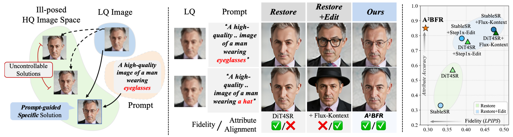
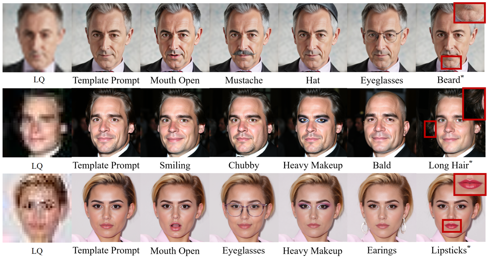
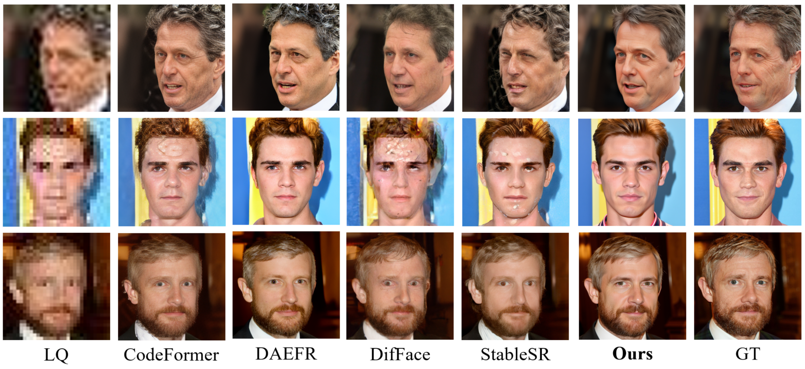
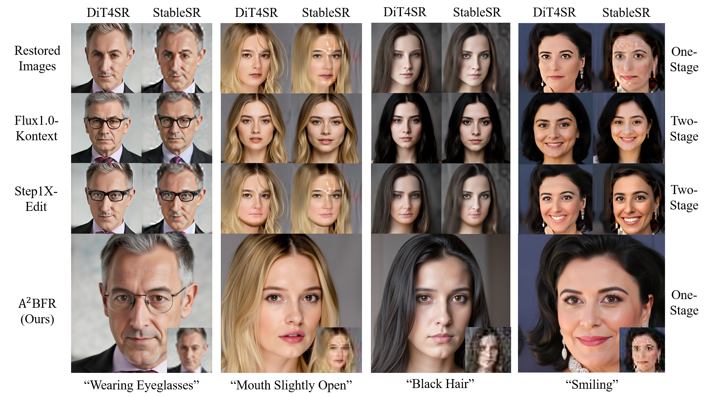
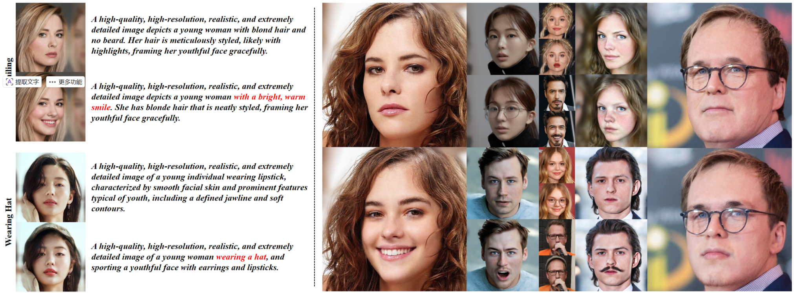

<h2>A2BFR: Attribute-Aware Blind Face Restoration</h2>

<!-- 

Yushun Fang1,2,\*&nbsp;&nbsp;&nbsp;&nbsp;Yuxiang Chen2,\*&nbsp;&nbsp;&nbsp;&nbsp;Shibo Yin2,†&nbsp;&nbsp;&nbsp;&nbsp;Qiang Hu1,†&nbsp;&nbsp;&nbsp;&nbsp;Jiangchao Yao1  
Ya Zhang1&nbsp;&nbsp;&nbsp;&nbsp;Xiaoyun Zhang1,†&nbsp;&nbsp;&nbsp;&nbsp;Yanfeng Wang1  
1Shanghai Jiao Tong University&nbsp;&nbsp;&nbsp;&nbsp;2Xiaohongshu Inc  
\*Equal contribution&nbsp;&nbsp;&nbsp;&nbsp;†Corresponding author
-->

## ⏰ Update
- **2025.12.30**: Repo is created.

:star: If A2BFR is helpful to you, please help star this repo. Thanks! 

## 🌟 Overview

  

1. Built on **FLUX.1-dev**, we train an **Attribute-Aware** blind face restoration (BFR) model using **LoRA**, and inject the low-resolution (LR) condition via **sequence concatenation**.  
2. With our **Attribute-Aware Learning** and **Semantic Dual Training** strategy, the BFR process can be jointly guided by text prompts, enabling **strong and accurate control over facial attributes**.  
3. We construct a large-scale face editing dataset **AttrFace-90K** primarily based on **FFHQ** and **ReFaceHQ**, **doubling** the dataset scale and the number of supported attributes compared to existing open-source datasets.

## 😍 Visual Results
### Customizable Results with Attribute Prompts

  

**A2BFR** enables customizable restoration via attribute prompts. Each column presents diverse outputs generated from the same low-quality input under different facial attribute conditions (e.g., *smiling*, *eyeglasses*), demonstrating controllable, user-directed face restoration.

### Comparison with BFR Methods

  

**A2BFR** delivers superior restoration quality compared with existing BFR methods.

### Comparison with Restore-then-Edit Pipelines

  

Restore-then-edit pipelines often compromise fidelity to the low-quality (LQ) input. In contrast, **A2BFR** produces restorations that are both **faithful** to the input and **aligned** with the specified attributes.

## 🗂️ Dataset

  

An overview of **AttrFace-90K**.

## ⚙ Dependencies and Installation

To be updated.

## 🍭 Inference with script

To be updated.

## 🔥 Training

To be updated.

## License
This project is released under the [Apache 2.0 license](LICENSE).

## Acknowledgement
This project is based on [OminiControl](https://github.com/Yuanshi9815/OminiControl).
We also leveraged [facer](https://github.com/FacePerceiver/facer)'s code in our project.
Thanks for these awesome work!